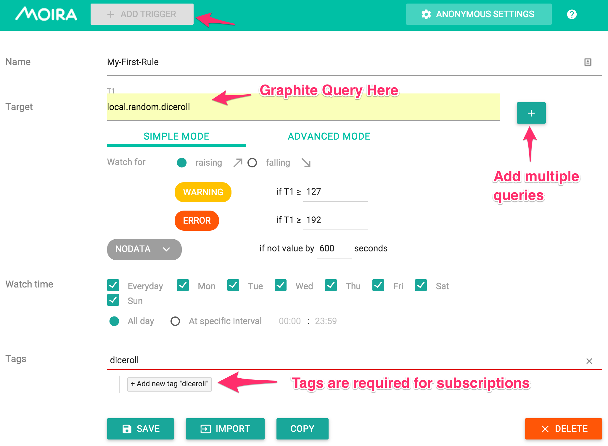
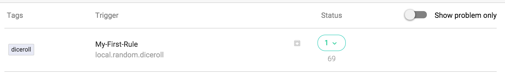
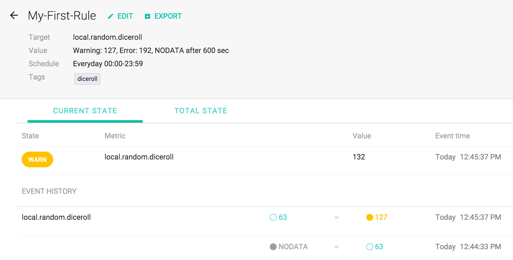
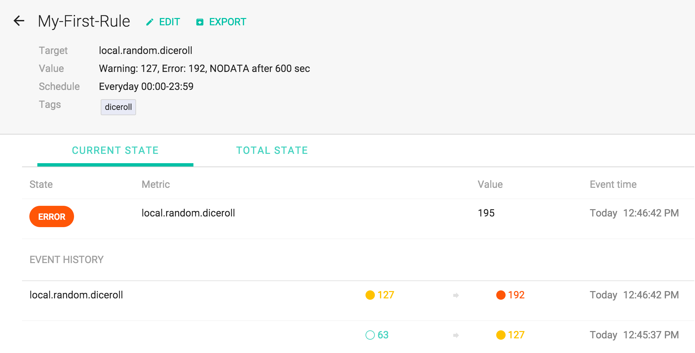

# Setting up Triggers

## Adding a new trigger

And heres what it looks like once you've created it;

## Trigger States

### Warning

### Error

# Development

A few tricks have been used to make these containers work.

1. Configuration is put into directories that only contain the config file
	* This is because you can't easily mount a file as a volume with docker-compose into an existing dir without replacing existing contents
2. Two main containers are used; one for the `golang` applications and one for `python` applications

## Running

    docker-compose up

## Testing

### UX

Navigate to http://$(docker-machine ip dev):8080/

### Send test data

     while [ true ]; \
     do \
        echo "local.random.diceroll $(expr $(date +%s) % 255) `date +%s`" | nc $(docker-machine ip dev) 2003; \
        sleep 1; \
      done
